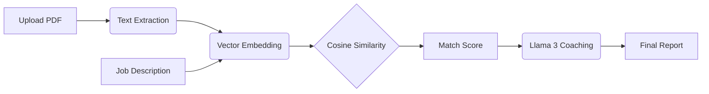

# 🚀 MNC Resume Analyzer
### AI-Powered Resume Analysis Engine · Groq + LangChain + FAISS + HuggingFace

<b>[**CLICK HERE TO OPEN**](https://mnc-resume-optimizer.streamlit.app/)</b>


---

## 📌 Overview

This is a production-grade AI pipeline designed to bypass traditional ATS limitations. It doesn't just look for keywords; it understands **semantic intent**. By converting resumes and job descriptions into high-dimensional vectors, it identifies how well your experience actually aligns with a role.

### Core Functions
* **Contextual Extraction:** Uses `pdfplumber` to handle multi-column and complex resume layouts.
* **Vector Embeddings:** Transforms text into 384-dimensional vectors using `all-MiniLM-L6-v2`.
* **LLM Insights:** Leverages Groq-accelerated Llama models for instant career coaching and gap analysis.
* **Match Scoring:** Calculates mathematical similarity to provide an objective compatibility percentage.

---

## 🛠️ Tech Stack

| Component | Tool | Purpose |
| :--- | :--- | :--- |
| **Frontend** | `streamlit` | Fast, interactive dashboard. |
| **NLP & Vectors** | `sentence-transformers` | Local semantic embedding generation. |
| **LLM Inference** | `Groq Cloud` | Ultra-low latency Llama 3.1/3.3/4 execution. |
| **Orchestration** | `langchain-groq` | Seamless LLM integration and prompt management. |

---

## 🏗️ Architecture




---

## ⚡ Quick Start

### 1. Installation
Clone the repository and install dependencies:
```bash
git clone https://github.com/YOUR_USERNAME/resume-analyzer.git
cd resume-analyzer
pip install -r requirements.txt
```

### 2. Configuration
Create a `.env` file in the root directory and add your API key. (The `.env` file is ignored by git for security).
```bash
GROQ_API_KEY=gsk_your_secure_key_here
```

### 3. Run the App
```bash
streamlit run app.py
```
Then, [**Click here to open**](https://mnc-resume-optimizer.streamlit.app/) in your browser.

---

## 📊 How the Score Works

The match percentage is determined by the **Cosine Similarity** between the resume vector ($A$) and the job description vector ($B$). This measures the cosine of the angle between two vectors, providing a score between 0 and 1.

$$score = \frac{A \cdot B}{\|A\| \|B\|}$$

Unlike old-school keyword counters, this method understands that "Software Engineer" and "Full Stack Developer" are semantically related.

---

## 📁 Essential Structure

```text
resume-analyzer/
├── app.py              # UI and Dashboard logic
├── utils.py            # Embedding and LLM processing
├── requirements.txt    # Project dependencies
└── .env                # Private API credentials (local only)
```

---

## 🔐 Security & Privacy
* **No Data Retention:** Files are processed in volatile memory and deleted after the session ends.
* **Secret Management:** API keys are managed via environment variables and never hard-coded.

---

## 📄 License
Distributed under the MIT License. See `LICENSE` for more information.
